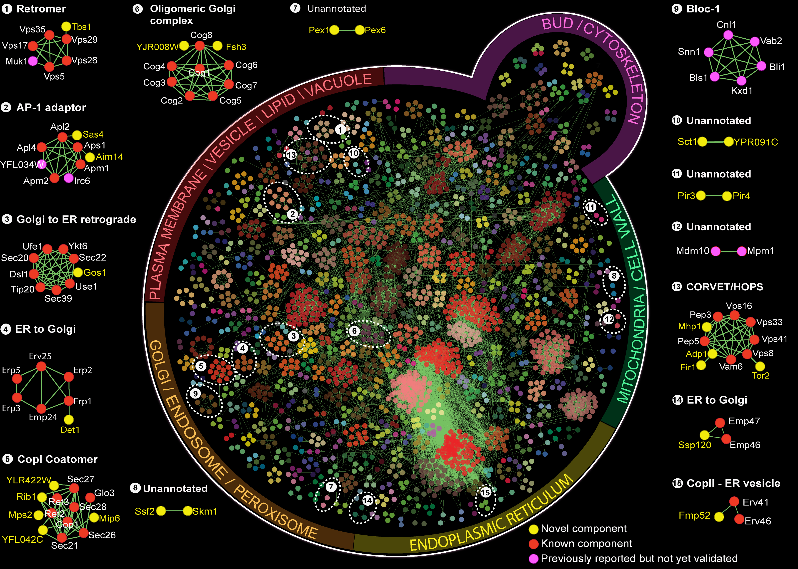

## TODO

1. Types of networks
2. Data used
3. Approaches (PGM, Bayesian nets, correlation, etc.)
4. Research questions that networks can be used to address
5. Network concepts (more from Kwame in a couple weeks...)

---

## The Big Picture

### Why networks?

- For most of the history of biology, a reductionist approach has been used to
  understand different parts of an ecosystem, an organism, a cell, etc.
- This has gotten us pretty far, but you can only understand so much by looking
  at things piecemeal...
- It is only by looking at how all of the parts work together (as a "system")
  that we can truly understand how something works.

---

## An analogy

source: http://onlyhdwallpapers.com/wallpaper/cars_golf_volkswagen_parts_desktop_1440x900_hd-wallpaper-44957.jpg

---

## Types of Biological Networks

1. Cell signalling
2. Metabolic interactions
3. Protein-protein interaction
4. Co-expression
5. Transcription factor binding
6. Protein-phosphorylation
7. Genetic interaction
8. Gene regulatory

**Basic goal**: understand cellular phenomena at a systems scale.

---

## Types of data used to construct biological networks

1. Flow cytometry
2. Expression data (Microarray, RNA-Seq)
3. TF binding (ChIP-chip, ChIP-Seq, etc)

---

## Transcription factor binding networks

### Overview

- TF binding data provides information of gene regulatory 
  relationships.
- Which proteins regulate which genes?

### Chromatin immunoprecipitation (ChIP)

- Provides information on *in vivo* protein-DNA binding associations.
- Antibodies targeting specific proteins are used to pull-down proteins in
  a sample and then associated DNA fragments measured.
- E.g. ChIP-chip and ChIP-Seq
  .

### Challenges

- Not all binding sites are near genes they regulate; may exist near unrelated
  genes.
- Binding sites may be either redundant or not functionally active.
- Role of binding site may be modified by conditions.

---

## Transcription factor binding networks

Bar-Joseph et al. (2003)

---

## Protein-protein interaction networks

<iframe width="640" height="480" src="//www.youtube.com/embed/Ms_ehUVvKKk"
frameborder="0" allowfullscreen></iframe>

---

## Protein-protein interaction networks

### Overview

- Protein-protein interation (PPI) networks describe direct 
  physical interactions between proteins in a cell.
- This includes:
  - Protein complexes
  - Transiently interacting proteins
- The complete set of protein interactions in a cell is sometimes referred to
  as the interactome

### Data Sources

- Yeast two-hybrid (Y2H)
- Affinity purification
- Tandem affinity purification coupled to mass spectometry
  (TAP-MS)

### Challenges

- Y2H data is collected *in vitro* and may not provide an accurate 
  reprensentation of the catalog of interactions that actually take place in a 
  cell under normal conditions:
  - Real interactions may not hold up and will be missed
  - Complexes that do not form *in vivo* may be found *in vitro*
- Affinity purification can be noisy (protein contamination.)
- Overlap between Y2H is not 100%.

---

## Protein-protein interaction networks

Yeast Membrane Proteins Interaction Network (Babu lab)

---

## References

- Ziv Bar-Joseph, Georg K Gerber, Tong Ihn Lee, Nicola J Rinaldi, Jane Y Yoo, François Robert, D Benjamin Gordon, Ernest Fraenkel, Tommi S Jaakkola, Richard A Young, David K Gifford,   (2003) Computational Discovery of Gene Modules And Regulatory Networks.  <em>Nature Biotechnology</em>  <strong>21</strong>  1337-1342  <a href="http://dx.doi.org/10.1038/nbt890">10.1038/nbt890</a>
- Javier De Las Rivas, Celia Fontanillo, Fran Lewitter,   (2010) Protein–Protein Interactions Essentials: Key Concepts to Building And Analyzing Interactome Networks.  <em>Plos Computational Biology</em>  <strong>6</strong>  e1000807-NA  <a href="http://dx.doi.org/10.1371/journal.pcbi.1000807">10.1371/journal.pcbi.1000807</a>
- Peter J. Park,   (2009) Chip–Seq: Advantages And Challenges of A Maturing Technology.  <em>Nature Reviews Genetics</em>  <strong>10</strong>  669-680  <a href="http://dx.doi.org/10.1038/nrg2641">10.1038/nrg2641</a>
- X. Zhu, M. Gerstein, M. Snyder,   (2007) Getting Connected: Analysis And Principles of Biological Networks.  <em>Genes & Development</em>  <strong>21</strong>  1010-1024  <a href="http://dx.doi.org/10.1101/gad.1528707">10.1101/gad.1528707</a>

