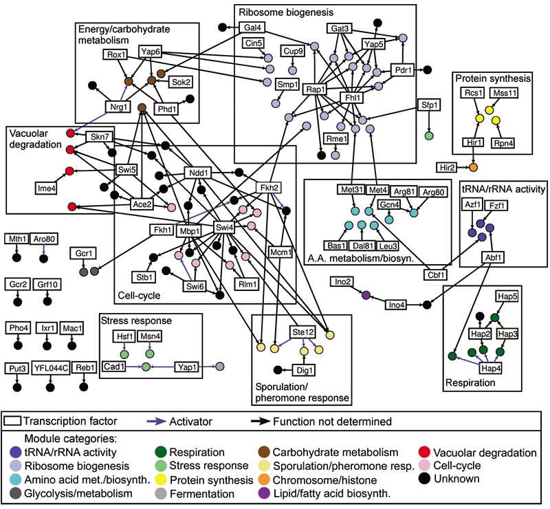

## The Big Picture

### Why networks?

- For most of the history of biology, a reductionist approach has been used to
  understand different parts of an ecosystem, an organism, a cell, etc.
- This has gotten us pretty far, but you can only understand so much by looking
  at things piecemeal...
- It is only by looking at how all of the parts work together (as a "system")
  that we can truly understand how something works.
- Once the quality of networks are sufficient, they can also be used to make
  predictions.

---

## The problem...

source: http://onlyhdwallpapers.com/wallpaper/cars_golf_volkswagen_parts_desktop_1440x900_hd-wallpaper-44957.jpg

---.segue .dark

## Types of Biological Networks

---

## Types of Biological Networks

1. Cell signalling
2. Metabolic interactions
3. Protein-protein interaction
4. Co-expression
5. Transcription factor binding
6. Protein-phosphorylation
7. Genetic interaction
8. Gene regulatory

---

## Types of data used to construct biological networks

1. Flow cytometry
2. Expression (Microarray, RNA-Seq)
3. TF binding (ChIP-chip, ChIP-Seq, etc)
4. Protein interaction (Y2H, TAP-MS)
5. Metabolite concentrations (NMR, LC/MS, etc)

---

## Transcription factor binding networks

### Overview

- Directed.
- TF binding data provides information of gene regulatory 
  relationships.
- Which genes (transcription factors) regulate which other genes?

### Chromatin immunoprecipitation (ChIP)

- Provides information on *in vivo* protein-DNA binding associations.
- Antibodies targeting specific proteins are used to pull-down proteins in
  a sample and then associated DNA fragments measured.
- E.g. ChIP-chip and ChIP-Seq
  .

### Challenges

- Not all binding sites are near genes they regulate; may exist near unrelated
  genes.
- Binding sites may be either redundant or not functionally active.
- Role of binding site may be modified by conditions.

---

## Transcription factor binding networks

Bar-Joseph et al. (2003)

---

## Protein-protein interaction networks

<!--<iframe width="640" height="480" src="//www.youtube.com/embed/Ms_ehUVvKKk"
frameborder="0" allowfullscreen></iframe>-->
Interleukin-1 binding to its receptor on a cell surface, created from
structural data (Youtube).

---

## Protein-protein interaction networks

### Overview

- Protein-protein interaction (PPI) networks describe direct 
  physical interactions between proteins in a cell.
- This includes:
  - Protein complexes
  - Transiently interacting proteins
- Undirected
- The complete set of protein interactions in a cell is sometimes referred to
  as the interactome

### Data Sources

- Yeast two-hybrid (Y2H)
- Tandem affinity purification coupled to mass spectometry
  (TAP-MS)

---

## Protein-protein interaction networks

### Challenges

- Y2H data is collected *in vitro* and may not provide an accurate 
  representation of the catalog of interactions that actually take place in a 
  cell under normal conditions:
  - Real interactions may not hold up and will be missed
  - Complexes that do not form *in vivo* may be found *in vitro*
- Affinity purification can be noisy (protein contamination.)
- Overlap between Y2H is not 100%.

---

## Protein-protein interaction networks

Yeast Membrane Proteins Interaction Network (Babu lab)

---

## Metabolic Networks

### Definition

> A metabolic network is the complete set of metabolic and physical processes
> that determine the physiological and biochemical properties of a cell. As
> such, these networks comprise the chemical reactions of metabolism, the
> metabolic pathways, as well as the regulatory interactions that guide these
> reactions. (Wikipedia)

### Overview

- Directed
- Nodes: metabolites
- Edges: biochemical reactions

---

## Metabolic Networks

### KEGG

source: http://www.cs.cmu.edu/~blmt/Seminar/SeminarMaterials/IntroMolBasDisease.html

---

## Metabolic Networks

Another view of the human metabolome...

source: http://nuit-blanche.blogspot.com/2011/11/instances-of-null-spaces-can.html

---

## Metabolic Networks

### Flux balance analysis (FBA)

- *In silico* approach commonly used for metabolic network reconstruction.
  Uses known stoichiometric information about metabolites for an organism.
- Assumes that organism is making optimal use of resources.
- Network parameters are chosen such that the steady-state biomass output or
  growth rate is maximized.
- Uses linear programming.
- Has been used successfully to make some predictions about affects of changes
  on a metabolic network.

---

## Co-expression Networks

@TODO

---.segue .dark

## Network construction

---

## Approaches used to construct biological networks

@TODO

---.segue .dark

## Biological network analysis

---

## So, I built a network... now what?

It's usually not enough to just build a network and print a pretty picture --
or at least, it shouldn't be enough -- instead a useful network should provide
some information about the system being investigated which is not immediately
available by looking at its component in isolation.

Depending on the type of network being investigated, different approaches may
be adopted:

- Module detection
- Annotation (e.g. "guilt by association")
- Impact of disease, etc. to underlying biochemical functioning
- Targeted drug development
- Comparative network analysis
- Network integration

---

## References

- Ziv Bar-Joseph, Georg K Gerber, Tong Ihn Lee, Nicola J Rinaldi, Jane Y Yoo, François Robert, D Benjamin Gordon, Ernest Fraenkel, Tommi S Jaakkola, Richard A Young, David K Gifford,   (2003) Computational Discovery of Gene Modules And Regulatory Networks.  <em>Nature Biotechnology</em>  <strong>21</strong>  1337-1342  <a href="http://dx.doi.org/10.1038/nbt890">10.1038/nbt890</a>
- Javier De Las Rivas, Celia Fontanillo, Fran Lewitter,   (2010) Protein–Protein Interactions Essentials: Key Concepts to Building And Analyzing Interactome Networks.  <em>Plos Computational Biology</em>  <strong>6</strong>  e1000807-NA  <a href="http://dx.doi.org/10.1371/journal.pcbi.1000807">10.1371/journal.pcbi.1000807</a>
- Peter J. Park,   (2009) Chip–Seq: Advantages And Challenges of A Maturing Technology.  <em>Nature Reviews Genetics</em>  <strong>10</strong>  669-680  <a href="http://dx.doi.org/10.1038/nrg2641">10.1038/nrg2641</a>
- Eytan Ruppin, Jason A Papin, Luis F de Figueiredo, Stefan Schuster,   (2010) Metabolic Reconstruction, Constraint-Based Analysis And Game Theory to Probe Genome-Scale Metabolic Networks.  <em>Current Opinion in Biotechnology</em>  <strong>21</strong>  502-510  <a href="http://dx.doi.org/10.1016/j.copbio.2010.07.002">10.1016/j.copbio.2010.07.002</a>
- X. Zhu, M. Gerstein, M. Snyder,   (2007) Getting Connected: Analysis And Principles of Biological Networks.  <em>Genes & Development</em>  <strong>21</strong>  1010-1024  <a href="http://dx.doi.org/10.1101/gad.1528707">10.1101/gad.1528707</a>

